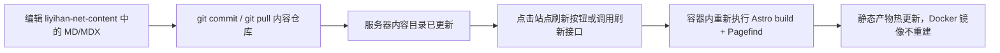

# 两仓库拆分计划

## 结论

推荐仓库名：

```text
HY-LiYihan/liyihan-net-site
HY-LiYihan/liyihan-net-content
```

这两个名字最清楚：

- `liyihan-net-site` 表示网站实现仓库，负责页面、组件、样式、Docker、CI/CD。
- `liyihan-net-content` 表示内容仓库，负责 Markdown / MDX、CV、论文、项目、图片、PDF、视频封面和 BibTeX。

## 目标

拆仓库要解决两个问题：

1. 修改 Markdown / MDX 时，不需要重新构建 Docker 镜像，也不需要碰站点源码。
2. 更新网站代码、主题、样式和 Dockerfile 时，不会误改或损坏长期内容。

## 职责边界

### `liyihan-net-site`

只放网站实现：

- Astro 页面、layout、component、style。
- MDX 可调用的组件，例如视频、链接卡片、交互 demo、图表组件。
- 内容 schema、路由、搜索索引构建、语言切换。
- Dockerfile、Compose 示例、GitHub Actions。
- 运行时刷新入口和管理按钮。

这个仓库可以独立构建 Docker 镜像。镜像代表“网站程序版本”，不代表“内容版本”。

### `liyihan-net-content`

只放长期内容：

- `blog/`：博客、笔记、长文。
- `projects/`：项目页。
- `publications/`：论文页和发表记录。
- `pages/`：CV、About 等独立页面内容。
- `assets/`：图片、PDF、视频封面、附件。
- `bibliography/`：BibTeX 或其他引用数据。
- `site.config.json`：站点名称、logo、首页图、首页文案和主题变量。

这个仓库可以频繁提交和同步。内容更新不触发 Docker 镜像构建。

## 内容目录约定

内容仓库建议使用下面的顶层结构：

```text
liyihan-net-content/
  blog/
  projects/
  publications/
  pages/
  assets/
    images/
    papers/
    videos/
  bibliography/
    publications.bib
```

站点仓库读取内容仓库的方式：

```bash
LIYIHAN_CONTENT_DIR=/path/to/liyihan-net-content npm run dev
LIYIHAN_CONTENT_DIR=/path/to/liyihan-net-content npm run build
```

当前站点代码已经支持 `LIYIHAN_CONTENT_DIR`。如果不设置这个变量，默认读取 `src/content/`，方便本地过渡和测试。

## 站点配置

内容仓库可以通过 `site.config.json` 控制站点级设置，不需要改站点实现仓库。

支持的配置包括：

- `locales.en` / `locales.zh`：网站标题、导航品牌名、副标题、描述、页脚、首页 hero 文案和按钮文案。
- `images.logo`：顶部品牌 logo。
- `images.avatar`：首页头像图。
- `images.hero`：首页主视觉图。
- `theme.variables`：CSS 变量，例如 `--bg`、`--surface`、`--text`、`--accent`、`--highlight`。

示例：

```json
{
  "locales": {
    "en": {
      "siteTitle": "Yihan Li Lab",
      "brand": "Yihan Li",
      "subtitle": "Robotics & Embodied Intelligence",
      "heroTitle": "Yihan Li"
    },
    "zh": {
      "siteTitle": "李溢涵",
      "brand": "李溢涵",
      "subtitle": "机器人与具身智能",
      "heroTitle": "李溢涵"
    }
  },
  "images": {
    "logo": "/assets/images/old-site/logo.gif",
    "avatar": "/assets/images/old-site/profile.png",
    "hero": "/assets/images/research-workspace.svg"
  },
  "theme": {
    "variables": {
      "--bg": "#f8f7f2",
      "--accent": "#28666e",
      "--highlight": "#b4452d"
    }
  }
}
```

图片路径建议使用 `/assets/...`，因为刷新脚本会把内容仓库的 `assets/` 发布到网站 `/assets/`。

## 更新流程



刷新按钮不应该直接修改内容，只负责触发站点重新扫描挂载目录并生成新的静态页面。

当前站点仓库提供两个刷新入口：

- 页面：`/en/admin/` 和 `/zh/admin/`。
- API：`POST /api/refresh`，请求头使用 `X-Refresh-Token: <LIYIHAN_REFRESH_TOKEN>`。

刷新流程会构建到临时目录，生成 Pagefind 索引，复制内容仓库的 `assets/` 到 `/assets/`，然后原子替换 Nginx 静态目录。构建失败时保留旧站点。

## Docker Compose 目标形态

生产环境推荐把内容仓库作为站点仓库的 `content/` 子模块维护。这样服务器上只需要一个部署目录，但内容仍然属于独立 Git 仓库：

```text
liyihan-net-site/
  compose.yaml
  Dockerfile
  content/                 # git submodule -> liyihan-net-content
    blog/
    projects/
    publications/
    pages/
    assets/
    bibliography/
    site.config.json
```

Compose 把这个子模块目录只读挂载到站点容器：

```yaml
services:
  liyihan-net:
    image: ghcr.io/hy-liyihan/liyihan-net-site:latest
    platform: ${LIYIHAN_PLATFORM:-linux/amd64}
    ports:
      - "${LIYIHAN_PORT:-6399}:80"
    environment:
      LIYIHAN_CONTENT_DIR: /content
      LIYIHAN_REFRESH_TOKEN: ${LIYIHAN_REFRESH_TOKEN}
      SITE_DOMAIN: ${SITE_DOMAIN:-liyihan.net}
    volumes:
      - ./content:/content:ro
    restart: unless-stopped
```

首次部署：

```bash
git clone --recurse-submodules git@github.com:HY-LiYihan/liyihan-net-site.git
cd liyihan-net-site
cp .env.example .env
docker compose up -d
```

内容仓库更新后：

```bash
cd /path/to/liyihan-net-site
git -C content pull
```

然后在网站上点击刷新按钮，或调用刷新接口。站点容器不需要重新拉镜像、重建镜像或重启。

接口调用示例：

```bash
curl -X POST http://localhost:6399/api/refresh \
  -H "X-Refresh-Token: replace-with-a-long-random-token"
```

内容仓库里的静态资产放在 `assets/`，刷新时会发布到网站 `/assets/`。建议资产文件名带版本或 hash，避免浏览器和 CDN 缓存旧文件。

## MDX 组件导入规则

内容仓库中的 MDX 不应该使用相对路径导入站点组件，因为内容仓库挂载位置会变化。

推荐写法：

```mdx
import VideoEmbed from "@components/VideoEmbed.astro";
import ResearchCounter from "@components/ResearchCounter";
```

不推荐写法：

```mdx
import VideoEmbed from "../../components/VideoEmbed.astro";
```

站点仓库负责维护这些别名，内容仓库只使用稳定接口。

## 分阶段实施

1. 在站点仓库中保留现有内容作为过渡样例，同时支持 `LIYIHAN_CONTENT_DIR`。
2. 新建 `HY-LiYihan/liyihan-net-content`，按目录约定迁移内容。
3. 新建或迁移站点仓库到 `HY-LiYihan/liyihan-net-site`，让 GitHub Actions 发布 `ghcr.io/hy-liyihan/liyihan-net-site`。
4. 把 `liyihan-net-content` 添加为站点仓库的 `content/` 子模块。
5. 服务器上使用 `git clone --recurse-submodules` 拉取站点仓库，Compose 挂载 `./content:/content:ro`。
6. 使用带鉴权的刷新接口和管理按钮，用于重新构建静态文件和搜索索引。
